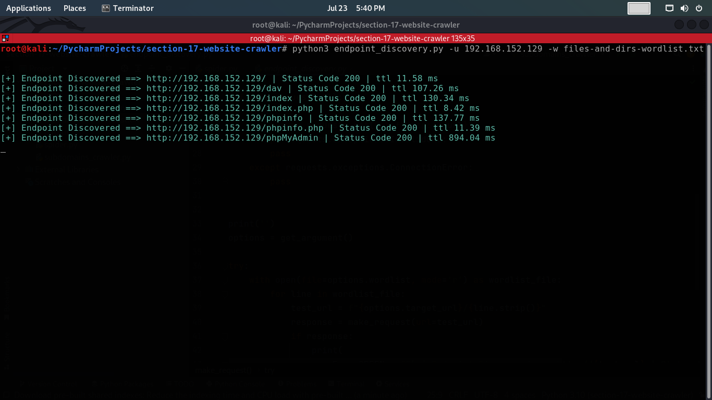

# Website Endpoint Discover
The "Endpoint Discover" project is a Python script designed to help security researchers and penetration testers discover and identify endpoints of a target website. By utilizing a wordlist of potential endpoint names, the script systematically sends HTTP requests to the target website, attempting to access each endpoint. If a response is received from the target server, the script identifies the discovered endpoint and provides relevant information, such as the HTTP status code and response time.
<br><br>
The script takes advantage of the "requests" library to make HTTP requests and the "colorama" library to enhance the output with colored messages. It provides a straightforward command-line interface to specify the target website URL and the wordlist containing potential endpoint names.
<br><br>
This project can be particularly useful for security testing, bug bounty hunting, or any scenario where identifying hidden or undocumented endpoints is critical to assessing a web application's security posture.

## Usage
1. Install the required dependencies:

    Before using the script, ensure that you have the required dependencies installed by running the following command:
    ```commandline
    pip install requests
    ```
2. Running the script:

    Use the following command to run the "endpoint discover" script:
    ```commandline
    python directory_crawler.py -u <target_url> -w <wordlist>
    ```
    - Replace `<target_url>` with the URL of the target website you want to scan for endpoints `(e.g., example.com)`.

    - Replace `<wordlist>` with the path to a valid wordlist file `(e.g., wordlist.txt)` containing potential endpoint names. Each line in the wordlist file should contain a single endpoint name.

3. Output:

    The script will display the discovered endpoints and their corresponding status codes and response times in milliseconds.
    
    **Note:** The script can be terminated at any time by pressing `Ctrl + C` in the keyboard.

## Screenshot


## Important Note:

Please ensure that you have proper authorization to scan and test the target website. Unauthorized scanning of websites or systems is illegal and unethical. Always obtain explicit permission from the website owner before performing any security assessments.
<br><br>
For legal and responsible use of this script, it is recommended to target websites you own or have explicit permission to test for security vulnerabilities
